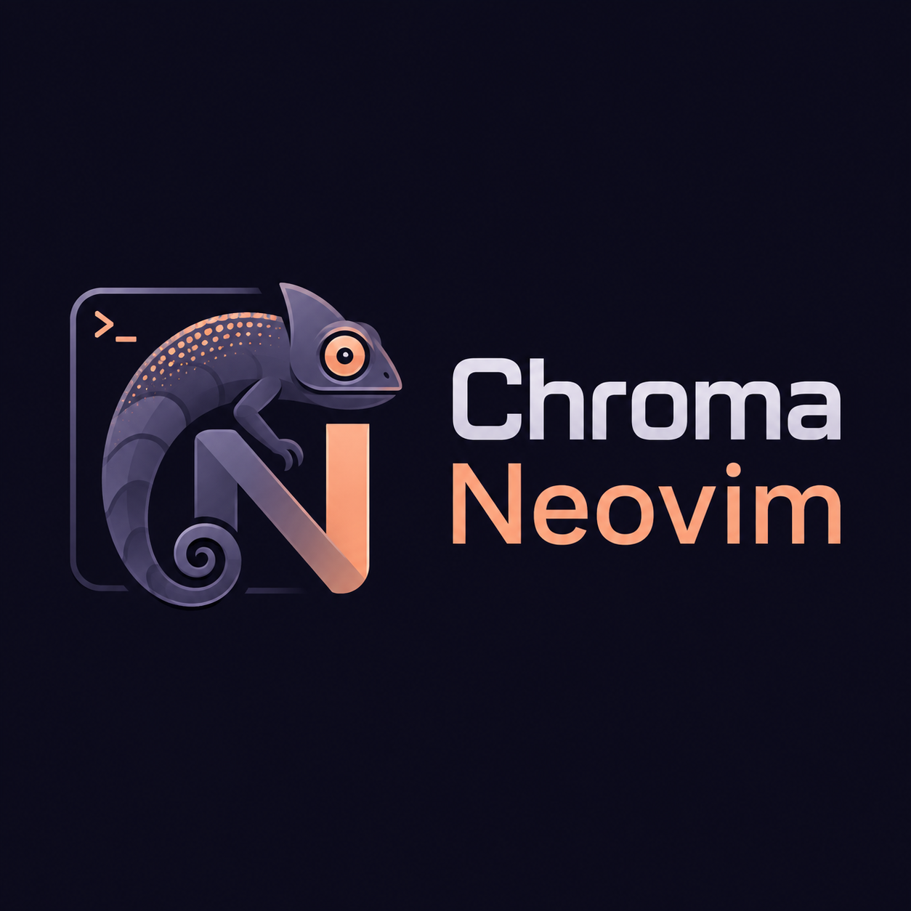

<div align="center">



**A Neovim environment for infrastructure work.**

🚀 fast · 🧩 modular · 🔧 easy to extend · 📦 maintained plugins only · 📝 documented · 🎨 Catppuccin Mocha

</div>

---

Chroma Neovim is a ready-to-use Neovim configuration for people who work with
infrastructure from a terminal. It brings the language servers, formatters,
linters, parsers and plugins for:

**Terraform / OpenTofu** · **Kubernetes** · **Helm** · **Ansible** ·
**Ansible Vault** · **AWS** · **Docker** · **GitHub Actions** · **YAML**

It is modular. Each of those is a component you can switch on or off, and the
editor loads only what you chose — a configuration with Kubernetes off installs
no `kubectl.nvim`, enables no `helm_ls`, and compiles no Helm parsers. See
`:help chroma-nvim-components`.

## Requirements

| Dependency | Version |
|---|---|
| Neovim | ≥ 0.12 |
| git | ≥ 2.19 |
| tree-sitter CLI | ≥ 0.26.1, from your package manager rather than npm |
| fzf | ≥ 0.36 |
| ripgrep, fd, bat | any |
| curl, tar, unzip, gzip | any |
| A C compiler | any |

A Nerd Font is recommended. That table is the whole list, and the versions in
it are floors rather than pins — each one is a requirement stated by something
Chroma depends on: lazy.nvim needs partial clones, nvim-treesitter names its CLI
version, fzf-lua names its fzf. Anything newer works.

## External tools

Terraform, OpenTofu, kubectl, Helm, Ansible, the AWS CLI and Docker are **not
installed or managed by Chroma**, and enabling a component does not ask for
them. Choosing Kubernetes asks for Chroma's Kubernetes features — the plugin,
the language server, the schemas, the parser. The `kubectl` those features shell
out to is yours to provide, and Chroma will not install, upgrade or shadow it.

So a missing one never blocks an installation. `chroma install` says at the end
which are not on PATH, `:checkhealth chroma` and `chroma doctor` say it again
whenever you ask, and the feature that needs one tells you when you use it —
which is the moment it matters. If you run OpenTofu rather than Terraform, that
is simply what the Terraform component uses.

What Chroma does pin is its own runtime — plugins, language servers, formatters,
linters and parsers, installed through lazy.nvim and Mason — so that one release
installs the same editor twice. You never have to think about that half.

## Installation

This repository **is** a Neovim configuration directory. It does not install
into one — it becomes one.

An installer (`chroma`, in [`cli/`](./cli)) is being built and is not released
yet; until it is, install it the way below.

### Alongside your current setup

`$NVIM_APPNAME` gives Neovim a configuration directory of its own, so nothing
you already have is touched or shared.

```sh
git clone https://github.com/ultherego/chroma-nvim.git ~/.config/chroma-nvim
NVIM_APPNAME=chroma-nvim nvim
```

### As your main configuration

Move anything that is there aside first — you will want it back if you change
your mind.

```sh
[ -e ~/.config/nvim ] && mv ~/.config/nvim ~/.config/nvim.backup
git clone https://github.com/ultherego/chroma-nvim.git ~/.config/nvim
nvim
```

Cloning elsewhere and symlinking works too; nothing here depends on where the
clone lives. See `:help chroma-nvim-installation`.

### First start

lazy.nvim bootstraps itself, Mason fetches the language servers and treesitter
compiles the parsers. Give it a minute, then run:

```vim
:checkhealth chroma
```

## Troubleshooting

Most of this configuration drives external programs, and when one is missing
the symptom is usually silence rather than an error. `:checkhealth chroma`
reports what is absent, what stops working without it, and which components are
enabled. `:Lazy` and `:Mason` cover the plugins and the packages.

If something behaves oddly rather than being absent, `:help
chroma-nvim-troubleshooting` lists the cases that have come up before and what
each one turned out to be.

## Uninstalling

Nothing is installed outside these directories:

```
~/.config/nvim          or ~/.config/<appname>
~/.local/share/nvim     plugins, Mason packages, treesitter parsers
~/.local/state/nvim     undo history, sessions, logs
~/.config/chroma        the component selection, if you made one
```

Remove those, restore whatever you moved aside, and no trace remains.

## Documentation

**In the editor:** `:help chroma-nvim` — every keymap, every component, the
safety model of the modules that handle secrets and run infrastructure
commands, and what they do and do not guarantee.

**Why it is like this:** [`DECISIONS.md`](./DECISIONS.md) — the reasoning behind
every choice, and what is deliberately absent. [`CONTRACT.md`](./CONTRACT.md) —
the rules this project is built under. [`cli/DESIGN.md`](./cli/DESIGN.md) — the
installer.

## License

[MIT](./LICENSE)
